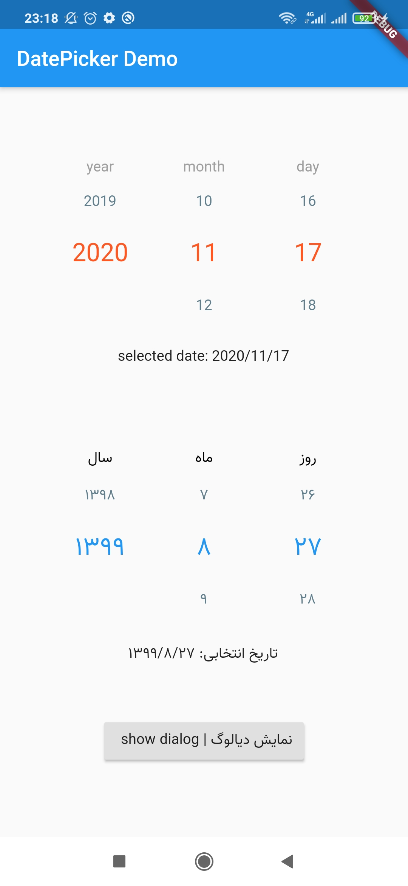
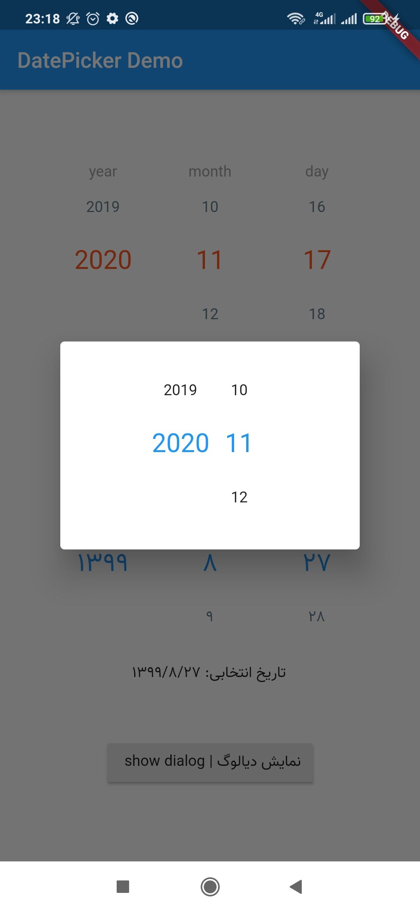

# Flutter Linear Date Picker 
Flutter Gregorian and Jalaali (Persian) date picker

<p align="center">
  
  
</p>

## How to use?
#### simple usage
just simply infalate following snippet in your flutter code:

```LinearDatePicker(); ```


#### advanced usage
You can customize widget using below parameters:
```
LinearDatePicker(
    startDate: "1396/12/12",
    endDate: "1398/01/14",
    initialDate: "1397/05/05",
    dateChangeListener: (String selectedDate) {
      print(selectedDate);
    },
    showDay: true,
    fontFamily: 'iran',
    textColor: Colors.black,
    selectedColor: Colors.deepOrange,
    unselectedColor: Colors.blueGrey,
    yearText: "سال | year",
    monthText: "ماه | month",
    dayText: "روز | day",
    showLabels: true,
    columnWidth: 100, 
    isJalaali: false
    ),
```